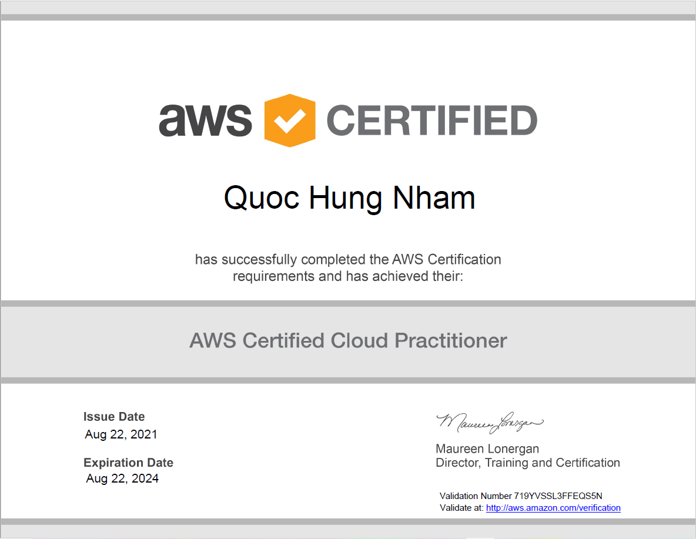

# DevOps
This repository is for practice and research with DevOps and Spark including these directories:

- **aws**: Create a CloudFormation stack
- **docker**: Migrate a database with Airflow and Docker Compose
- **scripting**: Revisions of bash scripting
- **spark**: In-depth research on Spark SQL's working and building automated performance tuning analyser tools for Spark

