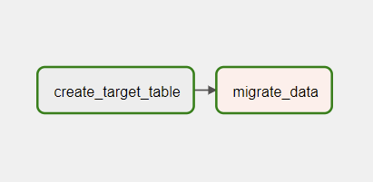

# Set-up Explanation

## Required task

Set up a basic data pipeline using Airflow to replicate the content of a sample Postgres database in one container to another.

| id | creation_date | sale_value |
| -- | ------------- | ---------- |
| 0  | 12-12-21 | 1000 |
| 1  | 13-12-21 | 2000 |

## Instructions

1. Clone this repository which contains the relevant `docker-compose.yml` file and `postgres_migration.py` which defines the Airflow DAG for data migration.
2. Follow the steps in [Running Airflow locally](https://airflow.apache.org/docs/apache-airflow/stable/start/local.html) manual in order to set up Airflow locally. This step will also set up an airflow home directory at `~/airflow` on a Linux machine.
3. In this directory where `docker-compose.yml` is located, run `docker-compose up` to set up the two Postgres containers using existing images from DockerHub. For container `db_1`, an SQL initiation script is mounted onto `/docker-entrypoint-initdb.d/init.sql` in order to populate the `source_db`. 
4. To access `db_1` container, follow these steps:
  - Run `docker ps` in another terminal to verify there are two running instances for `db_1` and `db_2`
  - Run `docker exec -it db_migration_airflow_db_1_1 bash` or `docker exec -it CONTAINER_ID bash` to access the container bash shell
  - In the container bash shell, run `psql -h db_1 -U root -d source_db` to access the source database containing our table. When prompted, enter `root` as password
  - Run `\dt` to see `data` table there. Run `SELECT * FROM data;` to see the content of our table
  - Do the same steps for `db_2` to verify that there is no `data` table in `db_2` yet. Use `psql -h db_2 -U root -d target_db` instead
5. Run `bash setup.sh` in order to move `postgres_migration.py` to `~/airflow/dags` which stores DAG definition files for execution and set up connections to the databases.
6. Open two new terminals, start the webserver and scheduler with `airflow webserver --port 5884` and `airflow scheduler` respectively.
7. Open another terminal and navigate to `~/airflow/dags`, verify that `python postgres_migration.py` has been copied here. Run `pip install apache-airflow-providers-postgres` to install Postgres provider package on top of existing Airflow installation and run `python postgres_migration.py` in order to create the DAG.
8. In your browser, open `localhost:5884` to login to Airflow webserver, using credentials you defined when installing Airflow at [Running Airflow locally](https://airflow.apache.org/docs/apache-airflow/stable/start/local.html)
9. Search for your DAG named `postgres_migration_dag` and unpause it for scheduling. This DAG is scheduled to be triggered only once.
10. Verify the status of all tasks as `success`. The DAG should look like this: 

  

11. Repeat step 4. for `db_2` with slightly different configurations in `docker exec -it db_migration_airflow_db_2_1 bash` and `psql -h db_2 -U root -d target_db`. Verify with `\dt` that the `data` table has been migrated and run `SELECT * FROM data;` to see the exact content in `target_db` as `source_db`

## Remark

Thank you for the interesting assignment!